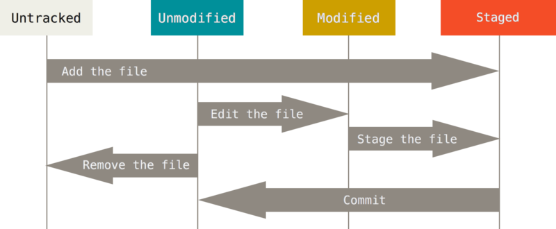

# Git原理

---

-   [前面的话](#前面的话)
-   [简述](#简述)
    -   [分布式版本控制](#分布式版本控制)
    -   [git描述](#git描述)

---

# 前面的话

-   本文摘自git官方文档. 参考: [Git-Book](https://git-scm.com/book/zh/v2 "https://git-scm.com/book/zh/v2")
-   对于理解过一遍git的人, 可以以此文章作为回顾. 对于完全不懂git的人, 推荐看一遍官方文档.

---

# 简述

## git描述

-   git对待数据更像是一个快照流. 每一个版本都对应各个文件的一个版本, 而不是保存的增量. 所以git系统跟像是一个小型文件系统.
-   因为git仓库在本地, 所以很多操作都可以在本地进行.
-   git以SHA-1散列值(hash值)作为内容的引用. 是个40位的十六进制字符.
-   只要将数据添加到git中, 数据很难丢失.

## git三种状态

-   所有文件都处于以下三种状态: 已提交(committed), 已修改(modified), 已暂存(staged). 
    -   已提交表明已经保存到本地数据库中. 
    -   已修改表示修改了文件, 但还没保存到数据库. 
    -   已暂存表示对已修改的文件的当前版本做了标记, 使之可以在下次提交时提交.
-   由此, git中存在三个区域: Git仓库, 工作目录, 暂存区域.
-   基本工作流程如下:
    -   在工作目录中修改文件
    -   暂存文件, 将文件快照放入暂存区域
    -   提交更新, 快照永久存储到git仓库目录

## 安装

自己想法吧.

## git配置

可以使用命令`git config`来控制git的外观和行为. 这些变量存储的位置如下:

-   /etc/gitconfig. 带有参数`-- system`选项读写此文件.
-   ~/.gitconfig 或 ~/.config/git/config. 只针对当前用户. 带有参数`-- global`选项读写此文件.
-   当前使用仓库的目录中的config文件(.git/config). 针对此仓库.

在windows系统中, Git会查找$HOME目录下(一般情况下是 C:\Users\$USER)的.gitconfig文件. Git同样也会寻找/etc/gitconfig文件, 但只限于MSys的根目录下,即安装Git时所选的目标位置. 

### 用户信息

```
$ git config --global user.name "John Doe"
$ git config --global user.email johndoe@example.com
```

### 文本编辑器

```
$ git config --global core.editor emacs
```

### 检查配置

检查所有配置

```
$ git config --list
```

检查某一项配置

```
$ git config <key>
```

### 获取帮助

```
$ git help <verb>
$ git <verb> --help
$ man git-<verb>
```

## git基础

状态转移图:


### 获取一个仓库

可以初始化一个仓库

进入一个目录执行初始化

```
$ git init 
```

可以克隆现有仓库

URL可以是`https://`协议, 也可以是`git://`协议, 也可以是SSH传输协议. name字段可以没有.

```
$ git clone [url] [name]
```

### 记录每次更新到仓库

工作目录下所有的文件都有两种状态: 已跟踪或未跟踪. 进入跟踪状态的文件有三种状态: 已提交, 已修改, 已暂存. 已提交和未修改意义是一样的.

查看哪些文件处于什么状态

```
$ git status # 状态
$ git status -s # 状态简览
```

关于简览: ??表示未暂存. A表示未跟踪新加入暂存区的文件. 左M表示进入暂存的数据与仓库数据不符, 右M表示工作区的数据与暂存区数据不符.

暂存已修改的文件

```
$ git add <file>
```

忽略文件, 编辑文件`.gitignore`
格式规范:

-   所有空行和以`#`开头的行都会被忽略
-   可以使用标准的glob模式匹配
-   可以以(/)开头防止地柜
-   可以以(/)结尾指定目录
-   要忽略指定模式以外的文件, 可以加上(!)表示取反

glob模式为简化的正则表达式. 星号匹配0+字符, [abc]匹配字符集, ?匹配一个任意字符, 两个星号匹配任意中间目录.

可以去[gitignore](https://github.com/github/gitignore "https://github.com/github/gitignore")找现成的

### 查看已暂存和未暂存的修改

查看区别

```
$ git diff # 工作区与暂存区的区别
$ git diff --staged # 暂存区与仓库的区别
```

提交更新

```
$ git commit -m "message" # 提交暂存区到仓库
$ git commit -a -m "message" # 提交工作区到仓库
```

移除文件
如果文件在暂存区中(一定修改过), 强制删除才行
我们想删除仓库和暂存区中的文件, 但不想删除工作区的文件, 用参数--cached
文件名可以使用glob匹配

```
$ git rm <file> # 工作区删除, 暂存区删除
$ git rm -f <file> # 工作区删除, 暂存区删除, 强制
$ git rm --cached <file> # 仓库删除, 暂存区删除
```

移动文件

```
$ git mv <fileA> <fileB> # 文件系统改名, 暂存区移除原文件, 添加新文件
等同于
$ mv <fileA> <fileB>
$ git rm <fileA>
$ git add <fileB>
```

### 查看提交历史

有很多参数. 不写

```
$ git log
```

### 撤销操作

上一次提交少提交了部分东西

```
$ git commit -m 'initial commit'
$ git add forgotten_file
$ git commit --amend # 将暂存区合并到上一个提交
```

取消暂存(将暂存区某文件同步成为仓库文件)

```
$ git reset HEAD <file>
```

注: reset 的 --hard 参数可能修改工作目录

撤销对文件的修改

```
$ git checkout -- <file>
```

是个比较危险的操作, 会丢失最近的修改, 这些修改没有提交到仓库.

### 远程仓库的使用

查看远程仓库

```
$ git remote # 显示远程仓库列表
$ git remote -v # 显示此远程仓库对应的URL
```

添加远程仓库

```
$ git remote add <remote-name> <url>
```

拉取仓库中有, 但本地没有的信息

```
$ git fetch <remote-name> # 远程仓库->本地仓库, 不会进入工作区间
```

如果使用的是clone命令, remote-name为origin. 所以可以执行`get fetch origin`来抓取克隆后的所有数据. 不会进入工作区间, 需要手动合并工作.

`git pull`会自动合并分支.

`git clone`会自动设置本地仓库master跟踪远程仓库master

推送到远程仓库

```
$ git push [remote-name] [branch-name]
```

只有你对remote-name有写入权限并且之前没人推送过, 才可以执行. 

查看远程仓库

```
$ git remote show [remote-name]
```

远程仓库的移除与重命名

```
$ git remote rename [RN-1] [RN-2] # 修改remote-name
$ git remote rm [RN] # 移除一个远程仓库
```

### 打标签

列出标签

```
$ git tag
$ git tag -l 'v1.8.5*'
```

创建标签

附注标签

```
$ git tag -a v1.4 -m 'my version 1.4'
```

查看标签

```
$ git show v1.4
```

轻量标签

```
$ git tag v1.4-lw
```

后期打标签
先找出要打版本的hash号

```
$ git log --pretty=oneline
$ git tag -a v1.2 9fceb02
```

共享标签
一般情况下, 不会把标签推动到远程仓库.

```
$ git push origin [tagname] # 推送一个标签
$ git push origin --tags # 推送多个标签
```

检出标签
并不能检出标签, 因为标签不能像分支一样移动, 但是可以让工作目录中的代码与某个标签一样:

```
$ git checkout -b [branchname] [tagname]
```

### git别名

```
$ git config --global alias.co checkout
$ git config --global alias.br branch
$ git config --global alias.ci commit
$ git config --global alias.st status
$ git config --global alias.unstage 'reset HEAD --'
```

如果是外部命令

```
$ git config --global alias.visual '!gitk'
```

## git分支

### 分支简介

每次提交都是一个版本. 这个版本有自己的hash值, 指向项目根目录的hash值. 所有的文件和目录都有自己的hash值.

每次新提交的版本会有父节点指向之前的版本.

git的分支本质是指向提交对象的指针. 

默认分支为master, 并无特殊含义, 只是因为初始化时默认创建了它, 又没人改.

### 分支创建

```
$ git branch <branch-name> # 在当前分支上创建, 不会移动到分支上.
$ git checkout <branch-name> # 切换分支. HEAD指向这个分支. 并且将工作区替换成分支
两个操作等同于:
$ git checkout -b <branch-name>
```

git有一个HEAD指针, 可以认为是分支的别名. 指向所在的本地分支. 

分支切换会改变工作目录. 如果不能干净的切换分支(工作区有未提交的内容), 将不会切换分支

创建分支只是在本分支上新建指针. 所以很快.

### 分支的新建与合并

```
已经有一个master分支
$ git checkout -b iss53
修改iss53数据, 并提交

准备修改紧急bug
$ git checkout master # 工作目录回到master的状态
$ git checkout -b hotfix
修改bug提交

bug改完要合并到master中
$ git checkout master # 切换到master
$ git merge hotfix # 将hotfix中数据合并到master
因为master是hotfix的直接上游节点, 所以可以直接快进

因为bug修改完了, 可以删除hotfix标签了
$ git branch -d hotfix

继续分支iss53
$ git checkout iss53
修改并提交

在分支上将主干(master分支)的修改合并进来
$ git checkout master
$ git merge iss53
由于是非直接上游, 所以合并可能失败
会基于共同祖先做三方合并.

iss53可以删除了
$ git branch -d iss53
```

### 关于三方合并, 出现冲突

```
$ git status # 会显示未合并状态的文件
```

文件中, 会显示冲突的地方, 上面是HEAD(master)文件, 下面是合并进来的文件(iss53). 修改后, 只要暂存了冲突的文件, 就会标记为冲突已解决.

可以使用图形化工具解决冲突

```
$ git mergetool
```

暂存后, 冲突状态的文件会被标记为冲突已解决, 之后需要提交才能完成整个合并.

### 分支管理

```
$ git branch # 分支列表, 显示当前分支
$ git branch -v # 分支列表, 会表明各分支指向的快照hash号
$ git branch --merged/--no-merged # 查看哪些分支合并到了当前分支
删除未合并的分支会报错, 因为相当于删除了就找不见了.
```

### 分支开发工作流

可以建立多个分支用于开发. 可分为主分支和特征分支.

### 远程分支

远程跟踪分支是对远程分支状态的引用, 你不能私自移动此引用, 只能与远程通信时改变, 通常命名为[remote]/[branch]. 

`fetch`命令就是将远程库的代码同步到本地, 不会改变当前分支的任何东西

`pull`命令是`fetch`命令和`merge`命令的合体操作.

```
$ git remote show [remote-name] # 联网查看远程的分支信息
```

```
$ git push [remote] [branch] # 将本地的branch分支推送到remote远程的branch上.
$ git push [remote] [local-branch]:[remote-branch] # 本地的分支名可以和远程分支名不一样.
```

```
第一次从远程下载代码
$ git remote add <remote-name> <url>
$ git fetch origin # 只下载代码, 和生成远程分支引用, 但是不修改工作区间
$ git checkout -b [local-branch] [remote]/[remote-branch]
```

从远程分支检出一个本地分支会自动创建一个"跟踪分支"/"上游分支". 跟踪分支是:与远程分支有直接关系的本地分支. 如果在跟踪分支上输入`git pull`, git能知道从哪个服务器的哪个分支上合并到当前分支.

```
$ git checkout -b [b1] [r1]/[b1]
===
$ git checkout --track [r1]/[b1]
```

可以在任意时间设置或修改跟踪分支, 
```
$ git branck -u/--set-upstream-to [r1]/[b1]
```

当处于跟踪分支中时, 可以用`@{u}`或`@{upstream}`来代表跟踪分支:
```
$ git merge [r1]/[b1]
===
$ git merge @{u}
```

可以看各个本地分支都跟踪了哪个远程分支`git branch -vv`

服务器上删除远程分支
```
$ git push origin --delete serverfix
```

### 变基

```
1. 基本操作
$ git checkout experiment 
$ git rebase master # 以master为基修改experiment的数据, 属于另一种合并方式
2. 特殊
$ git rebase --onto master server client # 将server和client的共同祖先到client的修改合并到master上.
之后的合并就可以走快速合并了
```

变基的风险: 不要对在你仓库外有副本的分支执行变基. 否则人民会唾弃你的.
具体讲, 公共库的变基, 会希望丢弃一下东西, 但是别人还有这些数据, 依旧会提交到仓库, 从而导致仓库变得很乱.

如果公共库变基了, 可以在合并时也使用变基
```
$ git pull --rebase
===
$ git fetch
$ git rebase teamone/master
```

自行选择合并或变基

## 服务器上的git

一般建裸仓库, 没有工作目录的..

### 协议

使用的协议: 本地协议, HTTP协议, SSH协议, Git协议. 

文件协议: 数据传输方便, 但安全性等不保障

智能HTTP协议: 当前在用. 可用用户名密码授权. 使用方便, 但管理和部署比较麻烦

哑HTTP协议: 好设置, 但当成文件服务系统用.

SSH协议: 架设容易, 安全高效, 但不可匿名, 比较私有.

Git协议: 无授权, 速度快, 难架设, 非标准端口, 一般用作只读.

### 其他

部署啥的, 到时候再说.

## 分布式Git

### 工作模式

集中式管理: 一个公共仓库, 其他人都可以读, 并且有写的权限. 共同维护一个公共库

集成管理者工作流: 每人都有一个公共库, 一个私有库, 有对任何公共库的读权限, 只有对自己公共库的写权限, 其中一个人是管理者. 其他人读管理者的公共库, 开发, 提交到自己的公共库, 请求管理者拉取自己公共库的代码合并. 

司令官副司令官工作流: 副官用于合并一部分代码, 汇总后交由司令汇总. 非常大的项目才会用到.

### 贡献代码

避免空白不同
关于提交信息, 最好是一行为主描述, 之后空白一行, 之后写详细描述