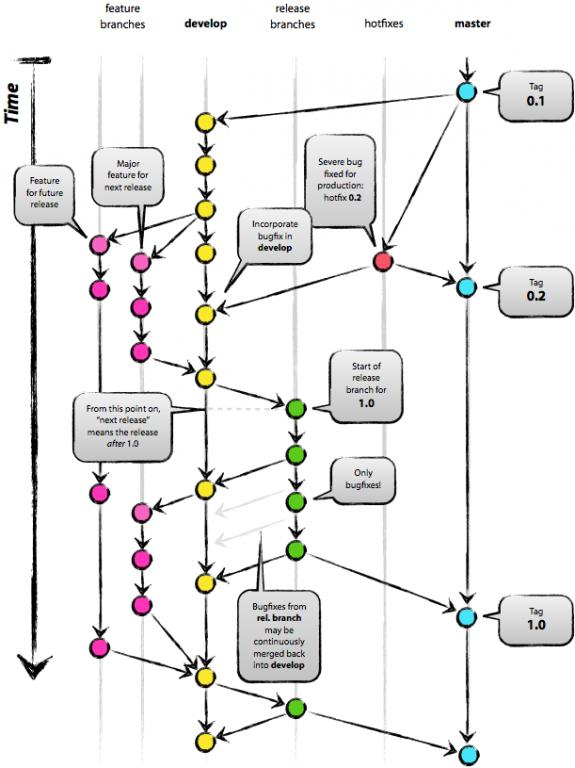

# Markdown基础语法

---

## 概述

### 兼容HTML

-   可以直接写HTML区块元素。
    -   如 `div`，`table`，`pre`，`p` 等标签。
    -   必须在前后加空行。
    -   开始与结尾标签不能用制表符和空格来缩进。
    -   HTML中的Markdown语法格式将不被处理。
-   可以写HTML的区段标签。
    -   如 `span`，`cite`，`del`等。
    -   可以在Markdown的段落、列表或标题中随意使用。
    -   Markdown语法在HTML区段标签间是有效的。
-   例子：

    ```
    这是一个普通段落。
    
    <table>
        <tr>
            <td>Foo</td>
        </tr>
    </table>
    
    这是另一个普通段落。
    ```

### 特殊字符自动转换

-   在HTML文件中，有两个字符要特殊处理： `<`和`&`。如果你想显示这些字符的原型，你需要使用实体形式如 `&lt;` 和 `&amp;`。
-   而在MD文件中，可以自然的书写这些字符，转换工作由他处理。
-   在MD中的code中，**一定**会将这两个符号转换为HTML实体。

---

## 区块元素

### 段落和换行

-   一个段落由多个连续的文本行组成。前后必须有一个以上的空行。
-   段落内换行要在在后面加两个空格后换行。*貌似git的解析器不用这么做。*

### 标题

Markdown支持两种标题的语法。**类Setext**形式和**类atx**形式。

-   类Setext类是用底线的形式。最少三个`=`或`-`。如：

    ```
    This is an H1
    =============
    
    This is an H2
    -------------
    ```

-   类atx形式是在行首插入1-6个`#`。对应标题的1-6阶。如：

    ```
    # 一级标题
    
    ##　二级标题
    
    ###### 六级标题
    ```

-   也可以在后面添加`#`，纯粹为了美观

### 区块引用

-   使用`>`。可以只在整个段落的第一行加，最好每行都加。
-   区块可以嵌套，根据层数加不同数量的`>`。
-   引用的区块中也可以使用其他的Markdown语法，如标题，列表，代码区块等。
-   如:

    ```
    > ## 这是一个标题。
    > 
    > 1.   这是第一行列表项。
    > 2.   这是第二行列表项。
    > 
    > 给出一些例子代码：
    > 
    > return shell_exec("echo $input | $markdown_script");
    ```

### 列表

支持无序列表和有序列表

-   无序列表使用星号，加号，减号作为标记，如：
    
    ```
    -   a
    -   b
    -   c
    ```
    
-   有序列表使用数字和一个英文句点

    ```
    1.  1
    1.  3
    1.  5
    ```
    
-   如果你想让列表更清晰，可以使用缩进
 
    ```
    -   a  
        b  
    -   c  
    	d
    ```
    
-   列表项目可以包含多个段落，每个段落都必须缩进4个空格或一个制表符

    ```
    -   a
        aa
    
        cc//新段落要缩进
    
    -   b
    -   c
    ```

-   如果想在列表中使用引用，那引用也要缩进

    ```
    -   a
        
        > dd
        > td
    
    -   b
    ```

-   如果想放代码块，也要再次缩进，*当然可用git的代码格式*

    ```
    -   a
    
            code
    
    -   b
    ```

-   项目列表可能不小心出现，可以在句点前加反斜线

    ```
    1902\. 地方
    ```

### 代码区块

-   缩进4个空格或一个制表符就能建立代码区块
-   代码区块会持续到没有缩进的那一行
-   在代码区块中，`<` `>` `&` 会被转为实体。而Markdown语法不会转换。

### 分割线

-   你可以在一行中用三个以上的星号、减号、底线来建立一个分隔线，行内不能有其他东西。
-   你也可以在星号或是减号中间插入空格。

---

## 区段元素

### 链接

支持两种链接语法：行内式和参考式

-   链接文字都是用方括号来标记。可以加标签
-   行内式：

    ```
    [百度](http://www.baidu.com "http://www.baidu.com")
    ```

    ```
    [test](./source/test.txt)
    [git](./source/1.jpg)
    ```

-   参考式：

    ```
    This is [an example] [id] reference-style link.
    [id]: http://example.com/  "Optional Title Here"
    [foo]: http://example.com/  (Optional Title Here)
    ```

-   网址可以用尖括号括起来，title属性可以放到下一行或缩进，*id不区分大小写*：

    ```
    [id]: <http://example.com/>  "Optional Title Here"
    [id]: http://example.com/longish/path/to/resource/here
        "Optional Title Here"
    ```

-   隐式链接标记

    ```
    [Baidu][]
    [Baidu]: www.baidu.com 百度
    ```

### 强调

-   使用`*`和`_`进行包围表示强调，一个表示斜体，两个表示粗体。
-   如果符号两边都有空白则会被当成普通符号。
-   如果没有空白却想单纯表示符号，则加反斜线。

### 代码

-   一小段行内代码可以用反引号`` ` ``

    ```
    ``There is a literal backtick (`) here.``
    `` ` ``
    ```

### 图片

类似链接来标记图片。有两种样式：行内式和参考式。

-   行内式：

    ```
    
    ```

-   参考式：

    ```
    ![Alt text][id]
    [id]: url/to/image  "Optional title attribute"
    ```

-   无法指定宽高, 如果需要请使用普通的``标签。

---

## 其他

### 自动链接

```
<http://www.baidu.com>
<example@163.com>
```

### 反斜线

支持以下字符转意：

```
\   反斜线
`   反引号
*   星号
_   底线
{}  花括号
[]  方括号
()  括弧
#   井字号
+   加号
-   减号
.   英文句点
!   惊叹号
```

---

## 附注

抄袭自：[Markdown语法](http://www.appinn.com/markdown/#link "http://www.appinn.com/markdown/#link")

---

# Github Flavored Markdown 的增强部分

1.  单词中有下划线, GFM会忽略
    
    ```
    test_test
    ```

2.  自动识别url地址

    ```
    http://www.baidu.com
    ```

3.  删除线
    
    ```
    ~~abc~~
    ```

4.  标准使用缩进表示代码段, GFM可以使用三个`` ` ``. 还支持语言标识

    ```javascript
    function test() {
        console.log("notice the blank line before this function?");
    }
    ```

5.  Task列表
    
    基本列表:

    ```
    - [ ] Task1
    - [x] Task2
    ```

    嵌套列表
    
    ```
    - [ ] Task1
        - [ ] Task1_1
    ```

6.  添加表情

    ```
    :blush:
    :joy:
    :grinning:
    ```

7.  支持表格

    ```
    | B1 | B2 |  
    | ---- | ---- |
    | q | p |
    | w | x |
    ```
    
    ```
    | Name | Description  | 
    | ------------- | ----------- |  
    | Help  | ~~Display the~~ help window.|   
    | Close | _Closes_ a window |
    ```

    支持格式位置

    ```
    | Left-aligned | Center-aligned | Right-aligned |
    | :--- | :---:  |  ---: |
    | git status   | git status | git status|
    | git diff | git diff   | git diff  |
    ```

    支持图片

## 附注

抄袭自:
*   [简书-GFM增强](http://www.jianshu.com/p/ae315ee086ae "http://www.jianshu.com/p/ae315ee086ae")

参考:
*   [Github-GFM](https://help.github.com/categories/writing-on-github/ "https://help.github.com/categories/writing-on-github/")
